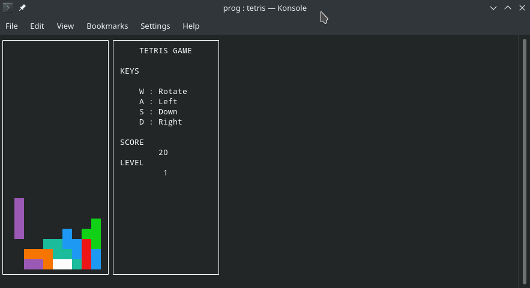

# Tetris in ncurses and C++



## Running the code

#### Tested Platforms

These platforms are tested to be working.

1. Mac OS X
2. Windows Subsystem for Linux (WSL)
3. Linux
4. FreeBSD
5. Android (Termux)
6. iOS 13 (Jailbroken)

#### Compiling from source

To compile the code, simply run the following in your shell.

```sh
./configure.sh
make
```

After compiling, the executable is in the `bin` folder. To run the game, type

```sh
./bin/tetris
```

> **Tip**
>
> If the folder path of your current working directory contains spaces, the compilation may fail.
> To solve this problem, try moving the repository to a folder with its path without spaces. For example, `~/`.

### Compile options

- **Clean** project generated binaries. (Excluding all downloaded resources).

  ```sh
  make clean
  ```

- **Clean all** existing binaries, configuration, libraries and SDKs. (Including all downloaded resources).

  ```sh
  make clean_all
  ```
  
- Compile only `ncurses` **(Not appliable for Jailbroken iOS)**

  ```sh
  make ncurses
  ```

> **Tip**
>
> If you run into a compilation problem. Always run `make clean` and try recompiling to see if it helps.

### Folder structure

| Folder           | Content                                                      |
| ---------------- | ------------------------------------------------------------ |
| `bin`            | The actual compiled executable file for tetris game. (`tetris`) |
| `obj`            | Object files emitted by compiler                             |
| `src`            | C++ source code for this project                             |
| `include/tetris` | Header files for this project                                |
| `local`          | Compiled `ncurses` library                                   |
| `ncurses`        | `ncurses` sources fetched on github                          |

## References

This code has referred and/or directly quoted code from the following sources

- Ncurses library
- https://youtu.be/8OK8_tHeCIA
- https://stackoverflow.com/questions/20326356/how-to-remove-all-the-occurrences-of-a-char-in-c-string
- https://stackoverflow.com/questions/16909164/function-pointer-multiple-definition
- https://stackoverflow.com/questions/23970721/how-to-shift-2d-array-elements-down-in-c
- https://www.tutorialspoint.com/cplusplus/cpp_date_time.htm
- https://stackoverflow.com/questions/2342162/stdstring-formatting-like-sprintf
- https://www.geeksforgeeks.org/csv-file-management-using-c/

## Development tools used

| Name               | Purpose                                                      | Link                          |
| ------------------ | ------------------------------------------------------------ | ----------------------------- |
| Typora             | Markdown editor                                              | https://typora.io             |
| Visual Studio Code | Code Editor with handy features and comfortable user interface | https://code.visualstudio.com |

## Third Party libraries used

- `ncurses`