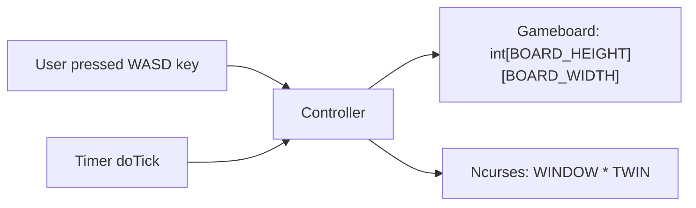

# Homebrew Tetris Project

### Controller Module Overview

Controller module can be regard as a controller in a typical software design pattern. 
Where I tried hard to implement this idea, it turns out this file of c++ code has become a horrifying mess.

#### Purposes of this file

1. Handle user inputs
2. Runs main game loop
3. 

### Update chain

### Functions

1. `void clearOldBlocks()`
   - Given a `WINDOW *`, it will clear the screen buffer at `posx`, `posy`.
